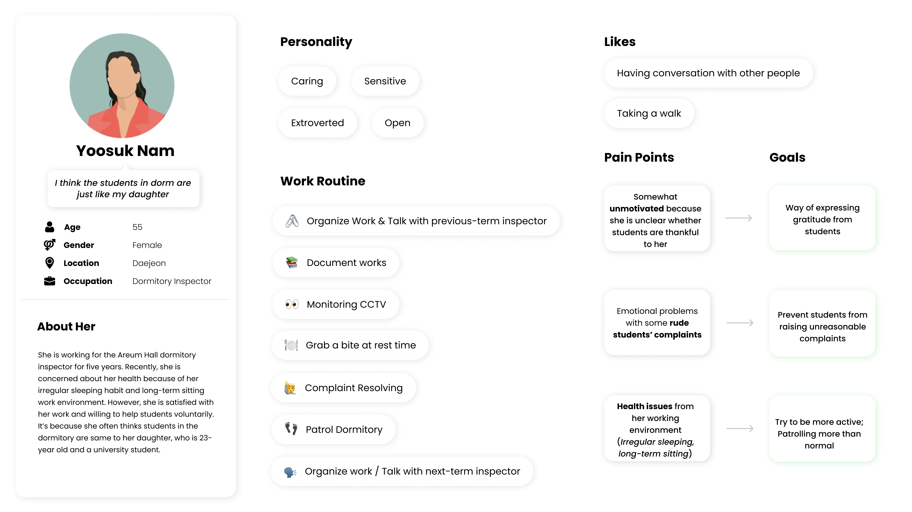

# DP2 Ideation Report

*Team: __dezign 2.0__*

*Members: Gangmin Lee, Yokyung Lee, Ihchae Ryu, Seonghyun Yang*

___

 

## POV

> Dormitory inspectors with extended shifts **need a way to** establish an appreciated position in the dormitory **because surprisingly** there exists an implicit sense of inferiority that causes both interior and exterior discouragement in their work.

 

## Persona

Let us introduce our persona, *Yoosuk Nam*.

 

## HMW

- HMW prevent students from being rude?
- HMW make use of the discouragement to elicit an empathetic and appreciative response from students?
- HMW explicitly expose the efforts of the inspectors?
- HMW avoid unreasonable complaints from the students?
- HMW make students express their gratitude and appreciation towards inspectors?
- HMW make inspectors conserve more pride in their role?
- HMW make students’ attitude towards inspectors be like “filial love”?
- HMW make inspectors feel the sense of belonging as a member of the community?
- HMW make the inferiority explicit instead of implicit?
- HMW completely change the uni-directional ‘demand & resolve’ relationship of students & inspectors?

 

## Top 3 HMW

- HMW make students express their **gratitude and appreciation** towards inspectors?
- HMW explicitly **expose the efforts** of the inspectors?
- HMW **avoid unreasonable complaints** from the students?

 

## Solutions

We generated 10 solutions for each of our top 3 HMWs.

 

> *HMW make students express their **gratitude and appreciation** towards inspectors?* 

- Express appreciation and recognition of inspector when he or she is patrolling nearby 
- A digital gift box in which students can pop in small letters or small e-gifts to express their appreciation
- Organizing regular collaborative campaigns where students and inspectors work together so that students could learn the difficulties of inspectors’ work
- Utilizing the CCTV camera to indirectly, but in an interesting way, do some physical action that expresses appreciation (like a heart with arms)
- Use broadcasting system with students’ phones (if phone location is in dorm), and students click “check” with an appreciation message
- A common lounge meal space for both inspectors and students, where those eating meal alone in their own office or room can use comfortably
- An app or kiosk that resolves basic requests and FAQs. Virtual avatar characters of each and every inspector guide students throughout the app. After students use the app, positive feedback and gratitude expressed to the friendly avatar character are delivered to the inspector as well.
- Virtual character of the inspector of that shift is visible on the outside of the office, and waves at students passing by and students can wave back too.
- Creating a personalized sign language between the inspector and the students to show appreciation (eg: clapping hands 3 times is for ‘thank you’)
- When you click your id card on the way in to the dorm, you make a certain facial expression and the AI detects your facial expression and sends it to the inspector

 

> *HMW explicitly **expose the efforts** of the inspectors?* 

- A virtual/digital patrol route mapping the specific patrol points and routes which the inspector is traveling, and updating the status of inspector (e.g. if he/she is busy doing a particular task)
- A visual board that alerts any updates regarding resolved requests (e.g. displaying before and after photos of repair, lounge vacuum cleaner is fixed, etc.)
- Posting a review of the resolved problem, and theses reviews can be used for inspectors to receive bonus
- Show walk count of the inspector in front of the office
- A widget that reveals the status of the inspector’s current status both physically and emotionally
- A board where inspector posts what he/she discovered might be problematic while patrolling, and students give opinions whether they agree with the solving the problem
- A system for inspectors to regularly report / showcase their activities or accomplishments to the students
- Having a collaborative project where students experience inspectors work by doing same work together with the inspector, raising awareness of the work done by inspector
- Utilize existing app like 열품타 that measures the amount of time you spend on productive work: students measure study time and inspectors measure their “productive” work time (but this standard will have to be specified)
- A visual “thermometer”-like board in which its “temperature” increases with every resolved student request. (e.g., 당근온도 in 당근마켓 app)

 

> *HMW **avoid unreasonable complaints** from the students?*

- A platform where students can share their experience or the process of their resolved problems to others so that students are aware of the common procedure and avoids any misunderstanding
- A way to conduct regular inspection so that inspectors can identify and address some problems before it gets too big
- Making an opportunity of collaborative problem solving with students and inspectors, so that they could work together, seeking for solutions
- Education from senior students (proctors) to freshmen about dormitory rules and how to properly raise complaints to inspectors
- Providing guidelines and education from inspectors so that students could respond to problems on their own, rather than complaining to inspectors
- Reveal the transparent process by updating on the current status which problem is being solved (e.g. the delivery process shown in online shopping platform)
- Use emotional emojis of the inspector’s avatars that give the impression “I’m just as desperate as you to get it solved”
- A fixed “office hour” time, when the office is open for casual or serious face-to-face conversations
- A standardized inquiry system that requires students to register requests with a format categorized regarding its content and purpose.
- An office structure that requires students to enter the office and sit down, facing the inspector with an equivalent posture. 

 

## Top 3 Solutions

- Express appreciation and recognition of inspector when he or she is **patrolling nearby** 
- Visually display the inspector’s geographic track to emphasize the **repetitive and widespread** work load
- Reveal the transparent process by **updating the current stage** of which problem is being solved

 

## Storyboard

> Solution 1: Express appreciation and recognition of inspector when he or she is **patrolling nearby**

 

> Solution 2: Visually display the inspector’s geographic track to emphasize the **repetitive and widespread** work load

 

> Solution 3: Reveal the transparent process by **updating the current stage** of which problem is being solved

 

## Studio Reflection

Here are the [feedbacks we received.](https://docs.google.com/document/d/16Vfk55X8IQukrz7jKaPkwXeoQb-jlpnB3FXuehgjBhs/edit)

 

### Q1: TA's feedback

> The solutions are interfaces used mostly by the students and not the target users (inspectors) themselves. It would be better to change the solutions or the target user.

### A1:

> For the first feedback, we decided to modify our HMW questions. First, it was originally “HMW make students express their gratitude and appreciation towards inspectors?” and we modified the focus of the inquiry as following: 
> 
> *“HMW make inspectors to **elicit** students’ gratitude and appreciation towards inspectors?”*.
>
>  
> For the second HMW, “HMW explicitly expose the efforts of the inspectors?” could be changed to: 
> 
> *“HMW help inspectors **explicitly expose** their efforts?”*
>
>  
> The last one, “HMW avoid unreasonable complaints from the students?” is modified to:
>
> *“HMW help inspectors **avoid or deal with** unreasonable complaints from the students?”*

***Additional reflection :***

Also, this is a **new solution** that is more directed to the target user for **revised HMW #1**:

- During students’ mundane routine of tapping their entrance card on the way in and out of the dormitory, the dormitory advisor, with a certain medium (undecided), can portray herself as an embracing, caring figure that the students can rely on. Unlike our previous solution, we are focusing on inducing an appreciative response from the student through the inspector’s expression of intimate and sincere care, like how parents would greet their children when they leave for or come back from school:
  - “It must have been another tough day, but I’m always so proud of you.”
  - “Take your umbrella with you! It’s going to rain today!”
  - “Remember, your happiness comes first!”

***NOTE :*** 
In our future DP, we are going to focus on the inspectors’ perspective, and we are planning to work on the revised HMW and solution more. 

 

### Q2: Student's feedback

> In the first solution, students are notified nearby, but they might not really want notification.

### A2:

> We did not intend to do it forcefully, of course. Students can select the pop-up to appear freely, and the purpose of this solution is to encourage casual interaction in a fun and humane manner.

 

### Q3: Student's feedback

> The dormitory inspector being nearby isn’t a necessary condition in order to provide ‘appreciation’. 

### A3:

> Regarding this feedback, the modified solution #1 could be helpful. Since, we are trying to naturally induce caring relationships between students and inspectors like we would do in a family, now inspectors don’t have to be nearby, but treat these appreciations casually like a greeting when we arrive home from the school.

 

### Q4: Student's feedback

> Wish there are more kinds of expressions to show appreciation to the inspectors.

### A4:

> Yes, we also had this conversation as a team. Many alternatives were suggested including various uses of emojis other than heart, or giving a gift to the inspector digitally. However, at this stage, we only showed heart in the storyboard to express the idea clearly. Surely we will discuss this further during future stages, but we also don’t want the app to be burdensome for the students, so we will keep it as minimal as possible.

 

### Q5: Student's feedback

> When the locations of inspectors are shown to students, problems like privacy concerns might happen.

### A5:

> We discussed similar worries at first, but in fact, the locations of the inspectors are not shown all the time, instead it is shared only when inspectors want to, for example when they are patrolling. We thought sharing the location during a patrol could also be useful because sometimes students cannot find inspectors at the office when they really need them, and patrolling is also a task that must be done. We will be more cautious regarding privacy issues.

 

### Q6: Student's feedback

> In DP1, the target user was shift workers, but this week, there is a divergence in target user to dormitory inspectors. Any reasons for such change?

### A6:

> For the last one, we got some feedback that the target user was quite broad, and we also thought we needed to focus on details, so we came to an agreement that dormitory inspectors are a better target.

 

### Q7: Student's feedback

> Wouldn’t providing a detailed location raise safety concerns and take away the reason why there is inspection? (e.g. students might hide illicit activities when inspectors bypass)

### A7:

> In fact our idea of this solution was partly because we thought there is a need to raise the awareness that inspectors are actually patrolling. It could actually reduce the illicit activities by allowing students to be conscious about inspectors patrolling. Nevertheless, we will have further ideation time to think of a way that could remove this worry completely, such as providing limiting details instead (e.g. limiting the range or boundary of accuracy of inspector's location).

 

## Updates in DP1 (*Optional)

- Change of **target user** : shift worker → dormitory inspector with extended shift
- New interesting insight  → “implicit inferiority" (demanding or rude requests, difficult to take a break, etc.)

